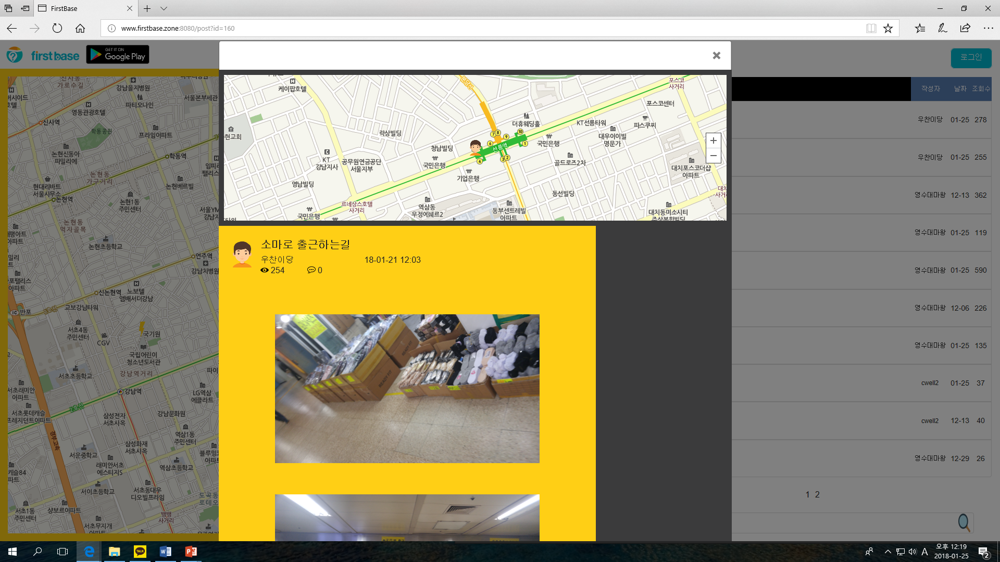
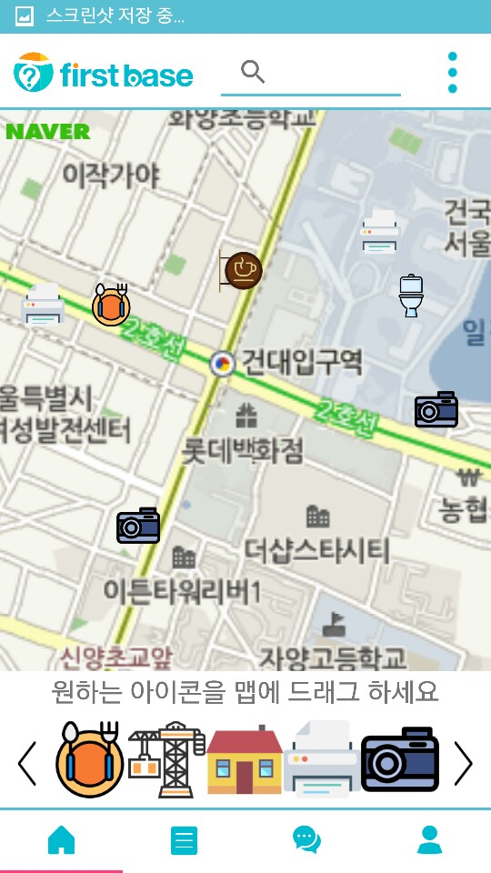

# FIRST BASE
> 위치기반 커뮤니티 서비스

* 서비스 종료

## 서비스 화면
### 웹 서비스

### 모바일 서비스

## 개발 스택

- Framework : Express (Node.js), FireBase
- Database : MySql, MongoDB
- Deploy : AWS ( EC2 | AWS Linux AMI , S3, RDS, DynamoDB,  CloudFront )
- API Document : [link ( Swagger.io )](https://app.swaggerhub.com/apis/firstbase8/firstbase/1.0.1)